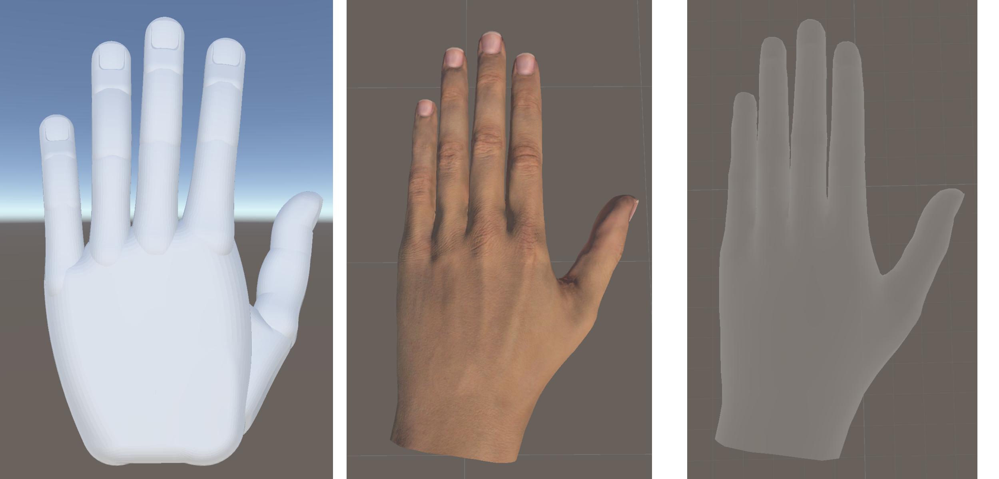
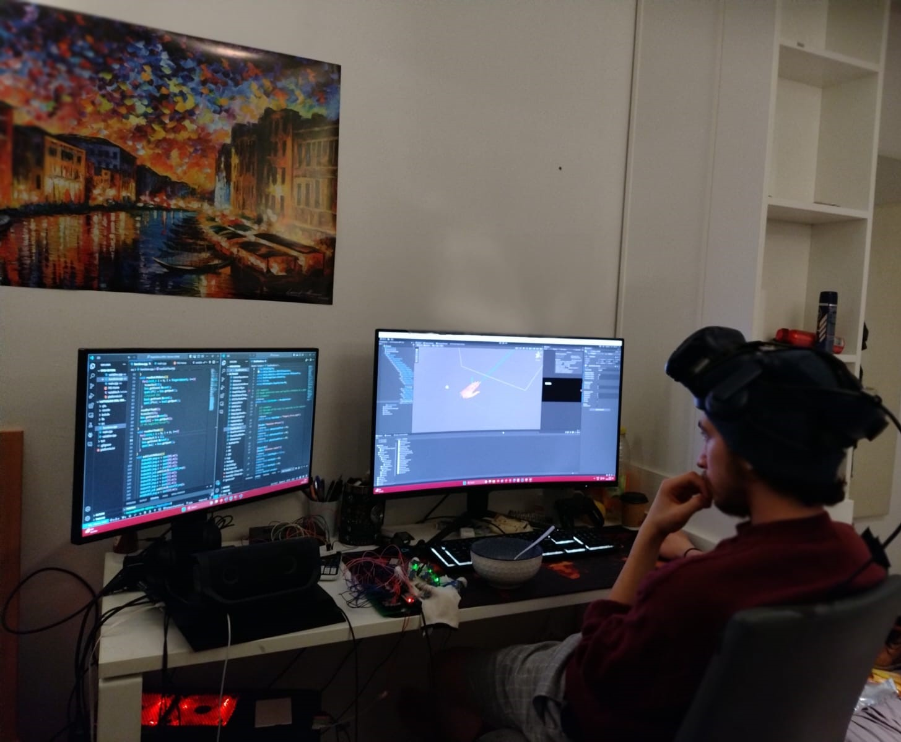

# AR-Hand: An Augmented Reality Remote Inspection System

This repository contains the source code and assets for the "Optimizing an Augmented Reality Environment and Data Glove Integration for a Remote Inspection System" bachelor thesis project. The project, developed at the Institute for Mechatronics (iMEK) at the Hamburg University of Technology, focuses on creating an immersive and responsive AR environment for remote inspection tasks, utilizing a custom-built data glove for hand tracking and interaction.

## Table of Contents

- [Project Overview](#project-overview)
- [System Architecture](#system-architecture)
- [Key Technologies](#key-technologies)
- [Project Structure](#project-structure)
- [Setup and Installation](#setup-and-installation)
- [Usage](#usage)
- [Media](#media)

## Project Overview

The primary goal of this project is to develop a robust and intuitive AR system for remote inspections. This system allows an expert to virtually inspect a remote location, interacting with the environment using a data glove that tracks hand and finger movements. The project aims to enhance safety, reduce costs, and eliminate geographical constraints for expert inspections.

The main objectives achieved in this thesis are:
- Development of a comprehensive hand movement tracking system in the AR environment.
- Optimization of latency and error in finger tracking for a responsive user experience.
- Integration of a user interface (UI) and customization options for the virtual hand.
- Analysis and improvement of data flow routes for enhanced system efficiency.
- Ensuring the project's adaptability for future technological advancements.

## System Architecture

The system consists of three main components:

1.  **Unity-based Augmented Reality Environment**: The AR environment is built using Unity 3D. It renders the virtual hand, displays the real-world view captured by the ZED mini-camera, and handles user interaction.
2.  **ESP32-based Data Glove**: A custom-built data glove equipped with BNO055 IMUs tracks the user's finger movements. An ESP32 microcontroller processes the sensor data and sends it to the ROS network.
3.  **Robot Operating System (ROS)**: ROS serves as the communication backbone of the system, connecting the data glove and the Unity environment. It handles the transmission of sensor data and other system messages.

The data flow is as follows:
- The ESP32 reads the quaternion data from the IMUs on the data glove.
- The data is published to ROS topics.
- The Unity application subscribes to these topics, receives the quaternion data, and applies the rotations to the virtual hand model.
- The ZED mini-camera provides the video feed of the real world, which is displayed in the HTC Vive Pro headset.
- The HTC Vive Tracker is used to track the position and orientation of the user's hand.

## Key Technologies

-   **Unity 2022**: Game engine for developing the AR environment.
-   **ESP32**: Microcontroller for the data glove.
-   **ROS Noetic**: Middleware for communication between system components.
-   **HTC Vive Pro & Vive Tracker**: For head and hand tracking.
-   **ZED Mini-Camera**: For capturing the real-world environment.
-   **BNO055 IMUs**: For tracking finger movements.
-   **OpenXR**: For handling VR/AR device integration in Unity.

## Project Structure

```
.
├── Assets/              # Unity project assets (scripts, models, scenes, etc.)
├── code_launch/         # ROS scripts and launch files
├── HapticGlove/         # ESP32 source code for the data glove
├── Media/               # Project media (images, videos)
├── Bachelor_Thesis_Nassif.pdf # Project thesis document
└── README.md            # This file
```

-   **Assets/**: Contains all the assets for the Unity project. The main scene is `ARHaptic.unity`. The C# scripts for hand tracking and other functionalities are in `Assets/Scripts/`.
-   **code_launch/**: Includes Python scripts for ROS nodes.
-   **HapticGlove/**: Contains the C++ source code for the ESP32 microcontroller.
-   **Media/**: Contains images and videos related to the project.

## Setup and Installation

### Hardware Requirements

-   PC with Windows and Ubuntu (via WSL2 or dual boot)
-   HTC Vive Pro with Lighthouse base stations
-   HTC Vive Tracker
-   ZED Mini-Camera
-   Custom-built data glove with ESP32 and BNO055 IMUs

### Software Requirements

-   Unity 2022.x
-   ROS Noetic (on Ubuntu)
-   SteamVR
-   ZED SDK

### Contact me for full project

## Media

Here are some images from the project:


*Figure: System Structure*


*Figure: The Data Glove in action*
